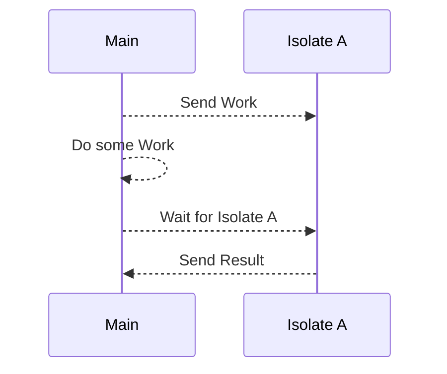

# Dart: The most underrated programming language

## Introduction

A few years ago, I started to get into the world of [Flutter](https://flutter.dev/).

It's a really cool framework for creating **cross-platform UI apps**. What I love so much about Flutter is its **hot-reload** feature and its support for **mobile**, **desktop** and **web**.

The flutter engine is built in **C++** for performance, but [Dart](https://dart.dev/) is the language used for app development.

The Dart language was originally designed to replace JavaScript inside the browser, but it has since evolved into a standalone language with its own runtime. Today, it's mainly used in combination with Flutter to create cross-platform apps or to build web services.

After Google published Flutter in 2017, they also acquired the Dart language, making it an official Google project.

## Dart Features

Dart has several features that make it a great language for app development.

### Dynamic and strong typing

Dart supports both **dynamic** and **strong** typing. One can even **forbid** dynamic or strong typing via the built-in analyzer.

```dart
void main() {
  // A "strong" type to hold any type.
  Object a = 1;
  // A "dynamic" type to hold any type.
  dynamic b = 2;
  // An actually strong type to hold an integer.
  int c = 3;
}
```

The main reason I hate Python and JavaScript is exactly this. Dynamic typing may add flexibility, but with poor editor support and runtime errors, development can be **extremely frustrating**.

Strong typing solves this in an elegant way and by using the `Object` type, one can still have the flexibility of dynamic typing.

By the way, this is one of the **core reasons** TypeScript exists.

### Object-oriented programming

Like many modern programming languages, Dart supports object-oriented programming with **classes** and **inheritance**.

```dart
class Jedi {
  String name;
  String rank;
  
  Jedi(this.name, this.rank);
}

class Yoda extends Jedi {
  Yoda() : super('Yoda', 'Master');
}

void main() {
  Yoda yoda = Yoda();
  print(yoda.name); // Yoda
  print(yoda.rank); // Master
}
```

### Asynchronous programming and concurrency using isolates

Dart allows using asynchronous programming and concurrency via **isolates**.

The whole ecosystem is built around `await` and **isolated workers**.

These workers run without direct access to anything but their own memory. Workers can only communicate with each other through message channels.

I won't get into the code here, but the whole concept of isolates is pretty simple:



### Built-in formatter and analyzer

Dart also has a built-in formatter and analyzer for code quality and style with a YAML configuration file:

```yaml
analyzer:
  exclude:
    - test/_data/p4/lib/lib1.dart
linter:
  rules:
    - camel_case_types
```

This allows extremely fine-grained control over code formatting and linting rules. You could make Dart more Java-like with strong typing or more Python-like with dynamic typing and create your own flavor of Dart.

### Ahead-of-time and just-in-time compilation support

Like Java, Dart supports both ahead-of-time (AOT) and just-in-time (JIT) compilation, but unlike Java, Dart has first class support for both and lets you compile your code to whatever you prefer.

Ahead-of-time compilation compiles your code to native machine code before runtime, while just-in-time compilation compiles your code to native machine code at runtime. AOT compilation is generally faster and more efficient, but JIT compilation is more flexible and may reach higher performance through dynamic optimization (although, many benchmarks I looked through, showed that AOT was superior in that way too).

You can compile your Dart code with:

```sh
dart compile exe my_app.dart # AOT compilation to native executable with a small dart runtime
dart compile aot-snapshot my_app.dart # AOT compilation to snapshot without a dart runtime
dart compile jit-snapshot my_app.dart # JIT compilation to bytecode with a dart runtime
```

You may also compile your code to JavaScript or WebAssembly.

**Fun Fact:** The Dart VM is actually faster than JavaScript and NodeJS and even faster than Java sometimes. The compiler uses multiple optimization techniques and is highly optimized for performance.

### A growing ecosystem of packages and tools

Dart has a package manager called `pub` which uses YAML for configuration.

```yaml
name: not-a-bomb
description: Not an atomic bomb. 
version: 1.2.3
homepage: https://atomic-bomb.com
documentation: https://atomic-bomb.com/docs

environment:
  sdk: '^3.2.0'

dependencies:
  efts: ^2.0.4
  transmogrify: ^0.4.0

dev_dependencies:
  test: '>=1.15.0 <2.0.0'
```

Even though Dart is relatively new, there are already many packages available on the [pub.dev](https://pub.dev) repository. Most of them are, however, focused on Flutter and web development.

Many packages can also be run at build-time like this: `dart run build_runner build`.

### Reflection and partial metaprogramming

Dart natively doesn't support metaprogramming yet, but many packages rely on compile-time code generation using [build_runner](https://pub.dev/packages/build_runner) and [source_gen](https://pub.dev/packages/source_gen).

The generators mostly use annotations to generate code at build-time.

One issue I have with all of this, is that it's still 3rd-party tooling that generates files inside your project. So when having multiple files that use meta-programming, you may end up with many generated files cluttering your project directory. But the Dart team is working on built-in metaprogramming support, which will hopefully reach stability in the near future.

### Summary

Dart solves many issues and is itself very configurable. It has the backing of Google and is already used in many Applications, but it's still more of a niche language used mainly with Flutter.

Even if Dart is so great, has a better performance and corporate backing, it mainly solved issues, that have already been solved by other languages. It does, however, combine all these solutions into one language, which is however overlooked by many developers, who think sticking with TypeScript or Java is good enough.

I hope Dart gets more recognition and adoption outside of Flutter and I love every new Project I start with Dart, because it's just so configurable and powerful.

Anyways, thanks for reading and I hope you enjoyed this post! Definitely try Dart if you haven't already. 

Cheers!
